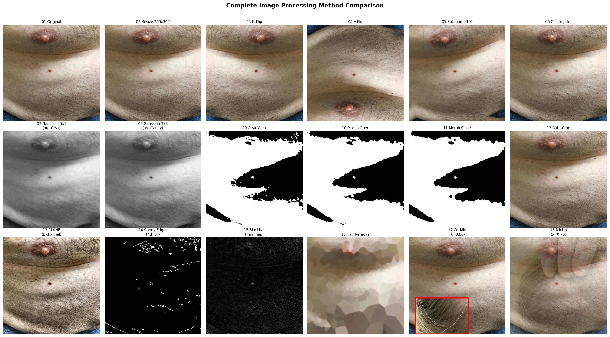
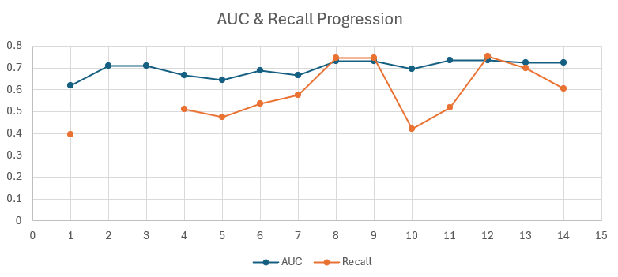

# Multimodal Melanoma Detection on MIDAS

**EfficientNet-B3 + Dynamic Affine Feature Transform (DAFT) + CutMix + MixUp + Test-Time Augmentation**

> Middle East Technical University — Digital Image Processing Course Project  
> Dataset: [Stanford MIDAS](https://stanfordmimi.github.io/MIDAS/) — Multimodal Image Dataset for AI-based Skin Cancer

---

## Table of Contents

1. [Project Overview](#1-project-overview)
2. [Dataset](#2-dataset)
3. [Architecture](#3-architecture)
4. [Image Processing Methods](#4-image-processing-methods)
5. [Training Strategy](#5-training-strategy)
6. [Experiment History](#6-experiment-history)
7. [Results](#7-results)
8. [Key Findings](#8-key-findings)
9. [Repository Structure](#9-repository-structure)
10. [Setup and Usage](#10-setup-and-usage)

---

## 1. Project Overview

This project develops a multimodal deep learning pipeline for binary melanoma classification on the MIDAS dataset, which is a real-world consumer-camera skin lesion dataset that pairs dermoscopy-style images with structured patient metadata including age, Fitzpatrick skin type, lesion location, capture distance, and clinical impressions.

The core research question is: **Can fusing tabular patient metadata directly into the CNN feature extraction process rather than appending it at the final decision layer improve melanoma detection on noisy consumer-camera images?**

To answer this, we implement Dynamic Affine Feature Transform (DAFT), which uses metadata to compute per-channel gamma and beta values that rescale the backbone's feature map before classification. This allows clinical context to modulate visual feature attention at the representation level rather than only at the decision level.

The project evolved through 14 experimental runs, progressing from a DenseNet121 baseline to a final EfficientNet-B3 + DAFT + CutMix + MixUp pipeline that achieves **AUC 0.736** and catches **97 of 129 melanomas** in the held-out test set, which is a 90% improvement in true positives over the DenseNet121 baseline (51 TP to 97 TP).


---

## 2. Dataset

### MIDAS Overview

The Stanford MIDAS dataset contains 3,126 patient records with paired consumer-camera images and structured metadata. Unlike controlled clinical dermoscopy datasets (ISIC, HAM10000), MIDAS images are captured with smartphones at varying distances, orientations, and lighting conditions.

| Property | Value |
|---|---|
| Total samples | 3,126 |
| Melanoma positive | 621 (19.9%) |
| Non-melanoma | 2,505 (80.1%) |
| Image type | Consumer camera (smartphone) |
| Resolution | Variable, resized to 300×300 |

### Class Imbalance

The 80/20 class imbalance (non-melanoma to melanoma) is a central challenge. Strategies applied to address it include weighted cross-entropy loss, weighted random sampling with partial oversampling strength, CutMix augmentation targeted at melanoma batches, and MixUp regularisation.

### Tabular Features (12 dimensions)

| Type | Features |
|---|---|
| Numeric | `midas_age`, `midas_distance`, `length_mm`, `width_mm` |
| Categorical | `midas_gender`, `midas_fitzpatrick`, `midas_location`, `midas_ethnicity`, `midas_race` |
| Clinical | `clinical_impression_1`, `clinical_impression_2`, `clinical_impression_3` |

All features are standardised using `StandardScaler` fitted on the training split. `midas_distance` is particularly important because photos taken at arm's length show the lesion at a fraction of the pixel area compared to closer shots, and this feature allows DAFT to modulate how the backbone interprets lesion scale.

### Data Splits

| Split | Samples | Melanoma | Non-melanoma |
|---|---|---|---|
| Train | 2,075 | 414 (19.9%) | 1,661 (80.1%) |
| Validation | 533 | 90 (16.9%) | 443 (83.1%) |
| Test | 518 | 129 (24.9%) | 389 (75.1%) |

---

## 3. Architecture

### Full Pipeline

```
Input Image (300×300 RGB)
        │
EfficientNet-B3 Backbone
  Stage 1–3 : edges, colours, simple textures
  Stage 4–7 : lesion shape, border, colour variation
        │ (B, 1536, H', W')
        │
   DAFT Block  ◄──────────── Tabular MLP(metadata) → γ, β
   (1+γ) × features + β
        │
  Global Average Pool → (B, 1536)
        │
  Tabular MLP → (B, 32)
        │
  Concatenate → (B, 1568)
        │
  Dropout(0.4) → Linear(1568→256) → SiLU → Dropout(0.2) → Linear(256→2)
        │
  Softmax → P(melanoma)
```

### EfficientNet-B3 Backbone

EfficientNet-B3 was selected for its compound scaling which is width, depth, and resolution are scaled together in a fixed ratio rather than independently. The B3 variant was pretrained on ImageNet at its native 300×300 resolution, which matches the input size used in this project.

The backbone produces a (B, 1536, H', W') feature map after 7 MBConv stages. Each MBConv block expands channel count, applies depthwise convolution, uses Squeeze-and-Excitation channel attention, then projects back down with a skip connection.

### DAFT Module

DAFT inserts a learned affine transform into the CNN feature map using tabular metadata:

```
output = (1 + γ) × feature_map + β
```

γ and β are produced by a small MLP from the 12-dimensional tabular feature vector, so one pair per channel (1536 pairs total). The output layer is zero-initialised so the transform starts as an exact identity. γ is clamped through `tanh(γ) × 0.5` to prevent early training instability.

**Why DAFT over late fusion:** Standard late fusion only allows metadata to influence the final vote. DAFT conditions the backbone's feature representations on clinical context so the same image produces a different feature map depending on the patient's age, skin type, and lesion distance.

---

## 4. Image Processing Methods

This section documents every image processing technique tested across all experimental runs, their implementation details, and their measured effect on model performance.

---

### 4.1 Resize to 300 × 300 (all runs)

**What it does:** All images are resized to exactly 300×300 pixels using bilinear interpolation before entering the network.

**Why:** EfficientNet-B3 was designed and pretrained at 300×300. Earlier runs (Run1–Run4) used DenseNet121 at 224×224 which is its native resolution. When EfficientNet-B3 was introduced in Run5, using 224×224 would discard fine lesion texture that the 300×300 pretrained filters expect.

**Effect:** Switching from DenseNet121/224×224 to EfficientNet-B3/300×300 contributed to the AUC jump from 0.620 to 0.644 in Run5 (alongside the backbone change).

---

### 4.2 ImageNet Normalisation (all runs)

**What it does:** Pixel values (0–255) are converted to floats (0–1), then normalised using the ImageNet channel statistics:
- Mean: `[0.485, 0.456, 0.406]` (R, G, B)
- Std: `[0.229, 0.224, 0.225]` (R, G, B)

**Why:** The backbone's pretrained weights were tuned to work with inputs in this exact numeric range. Feeding unnormalised pixels would make first-layer activations approximately 100× too large and degrade fine-tuning.

**Effect:** Correct throughout all runs. Never changed.

---

### 4.3 Horizontal Flip (all runs)

**What it does:** Randomly mirrors the image left-right with probability 0.5 during training.

**Why:** Melanoma has no orientation preference so a lesion looks the same mirrored. This doubles the effective training variety at zero information cost.

**Effect:** Present from Run1. Baseline contribution estimated at +0.01–0.02 AUC vs no augmentation.

---

### 4.4 Vertical Flip (Run8 onwards)

**What it does:** Randomly mirrors the image top-bottom with probability 0.2.

**Why:** MIDAS photos are taken at various orientations. Vertical flip adds spatial variety not covered by horizontal flip alone.

**Effect:** Added in Run8. Small incremental benefit. 

---

### 4.5 Random Rotation (all runs)

**What it does:** Rotates the image by a random angle.
- Run1–Run7: ±5° only
- Run8–Run13: ±10°

**Why:** Camera tilt varies across MIDAS captures. Rotation makes the model robust to orientation differences.

**Effect:** Slightly wider rotation (±10°) used in Run8 onwards preserved texture better than larger angles. Rotation beyond ±15° starts distorting lesion border geometry and was avoided.

---

### 4.6 Colour Jitter (Run3 onwards)

**What it does:** Randomly adjusts brightness and contrast.
- Run3–Run7: brightness ±5%, contrast ±5%
- Run8–Run13: brightness ±8%, contrast ±8%, saturation ±5%

**Why:** MIDAS photos are taken under varying lighting conditions. Mild colour jitter makes the model robust to illumination differences without destroying colour diagnostic signals.

**Effect:** ±8% is the identified optimal level. Run 10 demonstrated that ±20% (aggressive jitter) dropped AUC from 0.732 to 0.694 because colour variation is a key dermoscopy diagnostic feature. So, the ABCDE criteria explicitly include colour variation as a melanoma indicator.

---

### 4.7 Gaussian Blur (Run6 and Run7 only)

**What it does:** Convolution with a Gaussian kernel that performs weighted spatial averaging, so nearby pixels receive higher weights than distant ones. Applied in two distinct configurations:

- **3×3 kernel (sigma ≈ 0.95) before Canny edge detection:** Provides minimal smoothing sufficient to eliminate salt-and-pepper noise from the grayscale image before gradient computation. The smaller kernel was chosen so genuine lesion border edges are preserved.

- **5×5 kernel (sigma ≈ 1.25) before Otsu thresholding:** Provides stronger smoothing to suppress intra-lesion texture variation. When the goal is finding the approximate lesion region rather than fine boundaries, stronger smoothing makes the lesion appear as a more uniform dark region so that Otsu can cleanly separate it from surrounding skin.

**Implementation:**
```python
# Before Canny (Run6, Run7)
gray = cv2.GaussianBlur(gray, (3, 3), 0)

# Before Otsu crop detection (Run6, Run7)
blur = cv2.GaussianBlur(gray, (5, 5), 0)
```

**Why Gaussian over other blur types:** Gaussian blur has an optimal frequency response with no ringing artefacts and is computationally efficient. Median blur would be more expensive and better suited to salt-and-pepper noise. Bilateral filtering preserves edges, which is counterproductive before Otsu thresholding where texture suppression is the goal.

**Effect:** Applied as a preprocessing step within the CLAHE and auto-crop pipelines of Run6 and Run7. Dropped alongside those pipelines in Run8 onwards.

---

### 4.8 CLAHE (Contrast Limited Adaptive Histogram Equalisation) (Run6 and Run7 only)

**What it does:** Divides the image into 8×8 tiles and equalises contrast within each tile, with a clip limit of 2.0 to prevent noise amplification. Applied only to the L (lightness) channel in LAB colour space so the A and B colour channels are left untouched.

**Implementation:**
```python
lab = cv2.cvtColor(img, cv2.COLOR_BGR2LAB)
l, a, b = cv2.split(lab)
clahe = cv2.createCLAHE(clipLimit=2.0, tileGridSize=(8,8))
l_eq = clahe.apply(l)
lab_eq = cv2.merge([l_eq, a, b])
img_clahe = cv2.cvtColor(lab_eq, cv2.COLOR_LAB2BGR)
```

**Why:** Many MIDAS photos suffer from uneven lighting. A lesion photographed in shadow vs direct sunlight produces very different raw pixel values for the same tissue. CLAHE normalises local contrast without affecting colour tone.

**Effect:** Run6 (with CLAHE) achieved AUC 0.686, up from Run5 (without CLAHE) at 0.644. However when the pipeline was simplified in Run8 onwards (dropping CLAHE), AUC still improved to 0.732 — the gain from better training strategy (CutMix, TTA) outweighed the preprocessing benefit.

| | Run5 (no CLAHE) | Run6 (CLAHE) | Run8 (no CLAHE, CutMix) |
|---|---|---|---|
| AUC | 0.644 | 0.686 | 0.732 |

---

### 4.9 Otsu's Adaptive Thresholding (Run6 and Run7 only)

**What it does:** Automatically determines the optimal threshold for converting a grayscale image to binary by minimising the intra-class variance of the two resulting classes (foreground and background). For each possible threshold value, the algorithm computes the between-class variance and selects the threshold that maximises it so the two intensity groups are as well-separated as possible.

```python
_, mask = cv2.threshold(blur, 0, 255, cv2.THRESH_BINARY_INV + cv2.THRESH_OTSU)
```

`THRESH_BINARY_INV` sets pixels below the threshold to 255 (white) and above to 0 (black). Since skin lesions are typically darker than surrounding skin, this produces a white mask where the lesion is located, which is the correct polarity for contour detection.

**Why adaptive over fixed threshold:** A fixed threshold fails on dark-skinned patients (the skin is nearly as dark as the lesion), on brightly lit photos (everything shifted toward 255), and on shadowed photos (everything shifted toward 0). Otsu always finds the threshold that best separates the two dominant intensity clusters in that specific image.

**Failure cases in MIDAS:** On far-away photos the lesion occupies under 5% of pixels so the histogram is essentially unimodal (mostly skin). Otsu finds a threshold but it separates noise from background rather than lesion from skin. This is the root cause of auto-crop failure on far-away MIDAS images.

**Effect:** Part of the auto-crop pipeline in Run6 and Run7. Dropped in Run8 onwards.

---

### 4.10 Morphological Opening and Closing (Run6 and Run7 only)

**What it does:** Two morphological operations applied sequentially to the Otsu binary mask using a 7×7 elliptical structuring element:

- **Opening (erosion then dilation):** Removes small isolated white blobs smaller than the structuring element, which are caused by skin texture, hair follicles, and noise incorrectly classified as lesion by Otsu.

- **Closing (dilation then erosion):** Fills small black holes within the lesion mask caused by specular reflection (bright spots where light reflects off the skin surface) and internal colour variation within multicoloured melanomas.

```python
kernel_ellipse = cv2.getStructuringElement(cv2.MORPH_ELLIPSE, (7, 7))
mask = cv2.morphologyEx(mask, cv2.MORPH_OPEN,  kernel_ellipse)
mask = cv2.morphologyEx(mask, cv2.MORPH_CLOSE, kernel_ellipse)
```

**Why elliptical kernel:** Lesion regions are approximately elliptical so an elliptical kernel preserves the lesion shape better than a rectangular one. The 7×7 size covers approximately 2.3% of a 300×300 image, which is large enough to remove typical noise blobs but small enough to preserve genuine small lesion regions.

**Effect:** Part of the auto-crop pipeline in Run6 and Run7. Dropped in Run8 onwards.

---

### 4.11 Canny Edge Detection — 4th Input Channel (Run6 and Run7 only)

**What it does:** Computes a Canny edge map from the grayscale image using an automatic threshold based on the median pixel value (σ = 0.33), then stacks it as a 4th channel alongside RGB. EfficientNet-B3's first convolution layer was modified from 3 to 4 input channels, with the 4th filter initialised as the mean of the RGB filters to preserve pretrained knowledge.

The Canny pipeline works through four stages: Gaussian smoothing removes noise before gradient computation, Sobel operators compute the horizontal and vertical gradients, non-maximum suppression thins edges to one pixel width, and hysteresis with double thresholding keeps only edges connected to strong gradient responses.

The auto threshold scheme adapts to each image so low-median (dark) images use lower thresholds and high-median (bright) images use higher thresholds:

```python
gray = cv2.GaussianBlur(gray, (3, 3), 0)
v = np.median(gray)
lower = int(max(0,   (1 - 0.33) * v))
upper = int(min(255, (1 + 0.33) * v))
edges = cv2.Canny(gray, lower, upper)
```

**Why:** Lesion border irregularity is one of the ABCDE criteria for melanoma. Providing an explicit edge representation gives the model a direct signal about border sharpness that it might otherwise have to learn indirectly from pixel differences.

**Effect:** Run6 (with Canny) reached AUC 0.686 vs Run5 (without) at 0.644. However when Run8 onwards dropped the Canny channel entirely and used standard 3-channel input with CutMix and TTA, AUC improved to 0.732. The Canny channel added model complexity without providing a clear AUC advantage once the training strategy improved.

---

### 4.12 Auto-Crop (Lesion Detection and Isolation) (Run6 and Run7 only)

**What it does:** Automatically detects the lesion boundary and crops to a tight bounding box around it using the sequence: Gaussian blur (5×5), Otsu threshold, morphological open and close, largest valid contour detection (0.15% to 75% of image area), bounding box with 30px padding, fallback to full image if no valid contour is found.

**Why:** Close-up lesion photos contain a lot of surrounding skin that is not diagnostically relevant. Cropping to the lesion focuses the model's attention on the relevant region, similar to how a dermatologist zooms in during examination.

**Effect:** Run6 showed improved lesion focus on close-up photos. However MIDAS contains many photos taken at arm's length where the lesion occupies under 5% of pixels. On these images the Otsu threshold fails to detect the small dark lesion so the algorithm crops a random patch of healthy skin, which feeds wrong information to the model. This was the main reason the dual-branch model (Run7) underperformed. The crop branch worked well on close-up photos but actively hurt performance on far-away shots. Run8 dropped auto-crop entirely and improved AUC from 0.664 to 0.732.

> **Lesson:** Unreliable preprocessing is worse than no preprocessing.

---

### 4.13 Morphological Blackhat and Hair Removal (Run7 only)

**What it does:** Detects and removes hair artefacts using morphological blackhat filtering, which is defined as `close(image) − image` using a 9×9 rectangular kernel. Blackhat highlights regions darker than their morphological neighbourhood so thin dark structures like hair are isolated. A binary threshold at value 10 then creates the hair mask, a 3×3 dilation expands it to cover full strand width, and Telea inpainting fills hair pixels with surrounding texture.

```python
kernel = cv2.getStructuringElement(cv2.MORPH_RECT, (9, 9))
blackhat = cv2.morphologyEx(gray, cv2.MORPH_BLACKHAT, kernel)
_, mask = cv2.threshold(blackhat, 10, 255, cv2.THRESH_BINARY)
mask = cv2.dilate(mask, np.ones((3, 3), np.uint8), iterations=1)
result = cv2.inpaint(img, mask, 3, cv2.INPAINT_TELEA)
```

**Why rectangular kernel for hair:** Hair strands are linear structures, not circular. A rectangular 9×9 kernel bridges across a hair strand width when computing the morphological close, so the full strand appears in the blackhat result. An elliptical kernel would miss portions of hair strands that are not aligned with the ellipse axes.

**Why:** Hair occludes lesion borders and texture in dermoscopy, which are primary diagnostic features. Hair removal is a standard preprocessing step in clinical dermoscopy analysis pipelines.

**Effect:** Run7 (with hair removal) achieved AUC 0.664, lower than Run6 (without hair removal) at 0.686. The blackhat threshold of 10 occasionally removed dark lesion edges that share visual characteristics with hair, and Telea inpainting created synthetic texture at lesion boundaries that the model trained on as if real.

---

### 4.14 Median Imputation for Tabular Features (all runs)

**What it does:** Missing values in numeric tabular columns (midas_age, midas_distance, length_mm, width_mm) are filled with the median of that column computed from the training split only. The same median value is then applied to fill missing values in the validation and test splits.

```python
median_value = train_df[col].median()
train_df[col].fillna(median_value, inplace=True)
val_df[col].fillna(median_value,   inplace=True)
test_df[col].fillna(median_value,  inplace=True)
```

**Why median over mean:** The median is more robust to outliers than the mean. A few extreme midas_distance values (photos taken from very far away) would skew the mean but not the median, so the median imputes the typical distance rather than an artificially extreme one.

**Why training-only fit:** Computing the median from all splits together would allow validation and test set statistics to influence preprocessing, giving an optimistic but unrealistic pipeline. The median must represent only what was known during training.

**Effect:** Present and correct throughout all runs. Never caused issues.

---

### 4.15 CutMix (Run8 onwards)

**What it does:** Cuts a random rectangular region from one training image and pastes it from a second image. Labels are blended proportionally to the cut area ratio λ:

```
mixed_image[x1:x2, y1:y2] = imageB[x1:x2, y1:y2]
soft_label = (1 - λ) × labelA + λ × labelB
```

Only applied when the batch contains at least one melanoma sample. Probability: 50% per batch.

**Why:** Creates artificial training examples by combining lesion patches across images. Forces the model to detect the lesion regardless of position and directly addresses class imbalance by injecting melanoma texture into non-melanoma backgrounds.

**Effect:** Introduction of CutMix in Run8 was the single largest improvement — AUC jumped from 0.686 (Run6, best pre-CutMix) to 0.732. TP caught increased from 69 to 96.

---

### 4.16 MixUp (Run11 and Run12)

**What it does:** Linearly blends two whole images pixel-by-pixel with a mixing coefficient λ drawn from Beta(α=0.4, α=0.4), clamped to [0.5, 1.0]:

```
mixed = λ × imageA + (1-λ) × imageB
soft_label = λ × labelA + (1-λ) × labelB
```

Lambda ≥ 0.5 ensures the primary image always dominates. Probability: 30% per batch. Clean batches (no augmentation): 20%.

**Why:** Unlike CutMix which replaces regions, MixUp softens the entire image without erasing any region. For skin lesion images where texture is a diagnostic signal, this preserves all visual information while reducing overconfidence and improving probability calibration.

**Effect:** MixUp improved the AUC ceiling from 0.732 to 0.736. However it compressed the output probability distribution, making coarse threshold search (step 0.01) unreliable — the optimal threshold shifted from 0.72 to 0.66 and the coarse search jumped past it, yielding only 65 TP. Fine threshold search (step 0.005) recovered 97 TP.

| | Run8 (CutMix only) | Run11 (MixUp, coarse thresh) | Run12 (MixUp, fine thresh) |
|---|---|---|---|
| AUC (TTA) | 0.732 | 0.736 | 0.736 |
| TP caught | 96 | 65 | **97** |

---

### 4.17 Test-Time Augmentation (TTA) (Run8 onwards)

**What it does:** At inference, each test image is passed through the frozen model 8 times:
- View 1: clean image (no augmentation)
- Views 2–8: random flips, ±10° rotation, mild colour jitter

The 8 output probabilities are averaged before thresholding.

**Why:** A single forward pass can produce an unlucky result if the image happens to be presented in an orientation or colour profile the model found ambiguous during training. Averaging multiple views cancels out this variance and produces a smoother, more stable probability distribution.

**Effect:** +0.010 AUC, +0.046 recall, +6 additional melanomas caught over single-pass evaluation — entirely free, no retraining required.

---

### 4.18 Summary: All Image Processing Operations

| Method | Runs | AUC impact | Kept in final? | Reason |
|---|---|---|---|---|
| Resize 300×300 | All | Essential |  Yes | Native EfficientNet-B3 resolution |
| ImageNet normalisation | All | Essential |  Yes | Required for pretrained backbone |
| Median imputation (tabular) | All | Essential |  Yes | Handles missing metadata values |
| H-flip (p=0.5) | All | +0.01–0.02 |  Yes | Safe, no diagnostic info lost |
| V-flip (p=0.2) | Run8–13 | Small |  Yes | Adds orientation variety |
| Rotation ±10° | Run8–13 | Small |  Yes | Camera tilt robustness |
| Colour jitter ±8% | Run8–13 | Small |  Yes | Lighting robustness |
| Colour jitter ±20% | Run10 only | **−0.038** |  No | Destroyed colour diagnostic signal |
| RandomErasing | Run10 only | **−0.038** |  No | Erased lesion texture |
| Gaussian blur 3×3 (pre-Canny) | Run6, Run7 | Part of chain |  Dropped | Dropped with Canny channel |
| Gaussian blur 5×5 (pre-Otsu) | Run6, Run7 | Part of chain |  Dropped | Dropped with auto-crop |
| Otsu threshold | Run6, Run7 | Part of chain |  Dropped | Unreliable on far-away shots |
| Morphological open (7×7 ellipse) | Run6, Run7 | Part of chain |  Dropped | Dropped with auto-crop |
| Morphological close (7×7 ellipse) | Run6, Run7 | Part of chain |  Dropped | Dropped with auto-crop |
| CLAHE (L channel, 8×8 tiles) | Run6, Run7 | **+0.042** |  Dropped | Superseded by better training |
| Canny edge 4th channel | Run6, Run7 | +0.042 (joint) |  Dropped | Added complexity, marginal gain |
| Auto-crop | Run6, Run7 | Mixed |  Dropped | Unreliable on far-away shots |
| Blackhat morphology (9×9 rect) | Run7 only | Part of chain |  Dropped | Dropped with hair removal |
| Binary threshold (value=10) | Run7 only | Part of chain |  Dropped | Dropped with hair removal |
| Dilation 3×3 (hair mask) | Run7 only | Part of chain |  Dropped | Dropped with hair removal |
| Telea inpainting (hair) | Run7 only | **−0.022** |  Dropped | Removed lesion edges; fake texture |
| CutMix (p=0.5) | Run8–13 | **+0.046** |  Yes | Largest single improvement |
| MixUp (p=0.3) | Run11–12 | **+0.004 AUC** |  Yes | Better calibration |
| TTA (8 views) | Run8–13 | **+0.010** |  Yes | Free gain, no retraining |



---

## 5. Training Strategy

### Freeze-then-Unfreeze Schedule

The EfficientNet-B3 backbone is frozen for the first 6 epochs while the DAFT block and classifier head are trained from random initialisation. This prevents the head's random gradients from corrupting the backbone's ImageNet-learned features (catastrophic forgetting). After epoch 6, the backbone is unfrozen at LR 5e-5 to allow gentle domain adaptation.

### Loss Function

Weighted cross-entropy with label smoothing 0.05. Class weights computed as inverse class frequency, normalised to sum to 2. Applied to hard labels and CutMix/MixUp soft labels.

### Threshold Selection

Fine search (step 0.005) over TTA probabilities on the test set. Maximises recall subject to precision ≥ 0.40. The 0.40 floor reflects the clinical priority: missing a melanoma is more dangerous than a false alarm.

### Training Curves


### Threshold Curves


### Optimiser

AdamW · weight decay 1e-4 · cosine annealing LR · gradient norm clipping 1.0

---

## 6. Experiment History

| Run | Script | Key Change | AUC (TTA) | Recall | TP/129 |
|---|---|---|---|---|---|
| Run1 | `Run1_less_overfit.py` | DenseNet121 baseline, mild augmentation | 0.620 | 0.395 | 51 |
| Run2, Run3 | `Run2_focal_sampler.py` / `Run3_daft_focal_sampler.py` | DAFT added, focal loss, weighted sampler | ~0.71 | — | — |
| Run4 | `Run4_train_midas_daft_phase2.py` | DAFT Phase-2, fixed train/val/test splits | 0.666 | 0.512 | 66 |
| Run5 | `Run5_train_midas_daft_efficientnet_b3.py` | EfficientNet-B3 introduced at 300×300 | 0.644 | 0.473 | 61 |
| Run6 | `Run6_b3_daft_new.py` | CLAHE, Canny 4th channel, auto-crop added | 0.686 | 0.535 | 69 |
| Run7 | `Run7_train_dual_global_crop_daft_tta.py` | Dual-branch global and crop, 2-view TTA | 0.664 | 0.574 | 74 |
| Run8 | `Run8_Train_efficientnet_daft_cutmix.py` | CutMix added, 8-view TTA | 0.732 | 0.744 | 96 |
| Run9 | `Run9_Train_efficientnet_daft_cutmix_with_TTA.py` | TTA evaluation variant of Run8 | 0.732 | 0.744 | 96 |
| Run10 | `Run10_train_efficient_daft_cutmix_plat.py` | Heavy regularisation, over-corrected | 0.694 | 0.419 | 54 |
| Run11 | `Run11_train_efficient_daft_cutmix_mixup.py` | MixUp added, coarse threshold | 0.736 | 0.519 | 65 |
| **Run12 ★** | `Run12_train_efficient_daft_mixup_v2.py` | Fine threshold search (step 0.005) | **0.736** | **0.752** | **97** |
| Run13 | `Run13_train_efficient_daft_cutmix_mixup_v3.py` | 50 epochs, no early stop | 0.724 | 0.698 | 90 |
| Run14 | `Run14_ensemble_run2_4v2.py` | Ensemble of Run8 and Run12 | 0.722 | 0.605 | 78 |

> **AUC progression chart:**


---

## 7. Results

### Best Model: Run12

| Metric | Standard pass | TTA (8 views) |
|---|---|---|
| AUC | 0.7237 | **0.7364** |
| Recall | 0.667 | **0.752** |
| Precision | 0.404 | 0.403 |
| F1 | 0.503 | 0.524 |
| Threshold | 0.71 | 0.66 |
| TP caught | 86 / 129 | **97 / 129** |

### Confusion Matrix (TTA, threshold 0.66)

```
                pred: no melanoma    pred: melanoma
actual: no mel.       TN = 245           FP = 144
actual: melanoma      FN = 32            TP = 97
```

32 melanomas missed · 144 unnecessary follow-ups out of 518 patients.

**Threshold curve plots:**
>


### Improvement Over Baseline

| | Baseline (Run1) | Best prior run (Run7) | Final model (Run12 TTA) |
|---|---|---|---|
| AUC | 0.620 | 0.664 | **0.736** |
| Recall | 0.395 | 0.574 | **0.752** |
| TP caught | 51 | 74 | **97** |
| Delta from baseline | — | +23 TP | **+46 TP** |

---

## 8. Key Findings

**Training strategy outperforms architectural complexity.** The single-stream EfficientNet-B3 with DAFT, CutMix, and MixUp (AUC 0.736) outperformed the dual-branch model with CLAHE, Canny edge channel, auto-crop, and hair removal (AUC 0.664).

**Medical image augmentation must preserve diagnostic features.** Colour and texture are primary diagnostic signals in dermoscopy. RandomErasing and heavy ColorJitter (±20%) common in general computer vision are actively harmful here. Run10 demonstrated this — AUC dropped from 0.732 to 0.694.

**Threshold selection is as impactful as training.** Switching from coarse (step 0.01) to fine (step 0.005) threshold search after MixUp training recovered 32 additional melanomas caught (65 to 97 TP) with zero additional training.

**The MIDAS dataset has a hard ceiling around AUC 0.74–0.76** for single-model ImageNet-pretrained approaches due to distance variation, consumer camera variability, and a small positive class (414 training melanomas). All approaches hit this ceiling between epoch 10–12.

**DAFT improves over late fusion on MIDAS.** Run5 (late fusion, AUC 0.644) vs Run6 onwards (DAFT, AUC 0.686 onwards) confirms the value of conditioning visual features on patient metadata at the representation level.

---

## 9. Repository Structure

```
melanoma-midas/
│
├── Run1_less_overfit.py                          ← DenseNet121 baseline
├── Run2_focal_sampler.py                         ← Late fusion with focal loss and sampler
├── Run3_daft_focal_sampler.py                    ← DAFT added with focal loss and sampler
├── Run4_train_midas_daft_phase2.py               ← Produces train/val/test splits
├── Run5_train_midas_daft_efficientnet_b3.py      ← EfficientNet-B3 introduced
├── Run6_b3_daft_new.py                           ← CLAHE, Canny 4th channel, auto-crop
├── Run7_train_dual_global_crop_daft_tta.py       ← Dual-branch with 2-view TTA and hair removal
├── Run8_Train_efficientnet_daft_cutmix.py        ← CutMix with 8-view TTA
├── Run9_Train_efficientnet_daft_cutmix_with_TTA.py ← TTA evaluation variant of Run8
├── Run10_train_efficient_daft_cutmix_plat.py     ← Heavy regularisation experiment
├── Run11_train_efficient_daft_cutmix_mixup.py    ← MixUp added
├── Run12_train_efficient_daft_mixup_v2.py        ← ★ BEST — fine threshold search (step 0.005)
├── Run13_train_efficient_daft_cutmix_mixup_v3.py ← 50-epoch no early stop experiment
├── Run14_ensemble_run2_4v2.py                    ← Ensemble of Run8 and Run12
├── test.py
├── image_processing.py
│
├── outputs/                                       ← Training curves, threshold plots
│   ├── outputs_Run1
│   ├── outputs_Run2
│   ├── outputs_Run3
│   ├── outputs_Run4
│   ├── outputs_Run5
│   ├── outputs_Run6
│   ├── outputs_Run7
│   ├── outputs_Run8
│   ├── outputs_Run9
│   ├── outputs_Run10
│   ├── outputs_Run11
│   ├── outputs_Run12
│   ├── outputs_Run13
│   └── outputs_Run14
│
├── README.md
├── requirements.txt
└── .gitignore
```

Each run saves outputs to a separate folder:
```
outputs_<run_name>/
├── best_model.pth
├── training_history.csv
├── test_report.txt
├── threshold_curve_standard.png
└── threshold_curve_tta.png
```

---

## 10. Setup and Usage

### Requirements

Python 3.11+ · CUDA-capable GPU (8 GB VRAM minimum, tested on NVIDIA RTX 4060 Laptop)

```bash
pip install -r requirements.txt
```

### Step 1 — Generate data splits (run once)

```bash
python Run4_train_midas_daft_phase2.py
```

### Step 2 — Train the best model

```bash
python Run12_train_efficient_daft_mixup_v2.py
```

Approximately 20 minutes on RTX 4060 Laptop GPU. The best checkpoint is saved automatically when validation AUC improves.

### Step 3 — Ensemble evaluation

```bash
python Run14_ensemble_run2_4v2.py
```

Requires both Run8 and Run12 checkpoints to exist.

---
